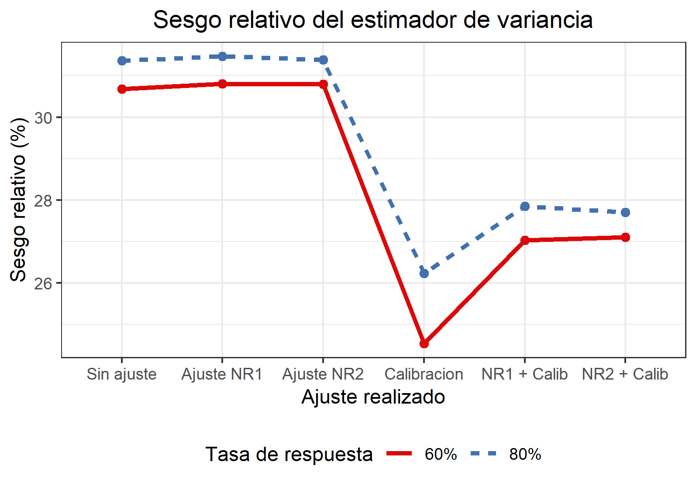
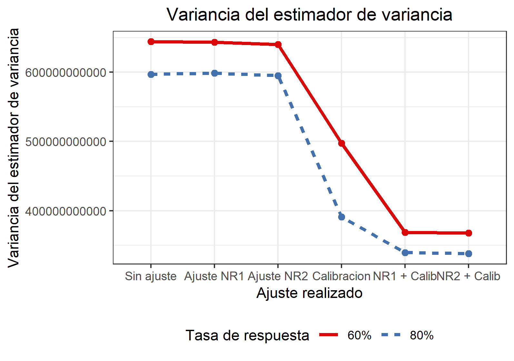
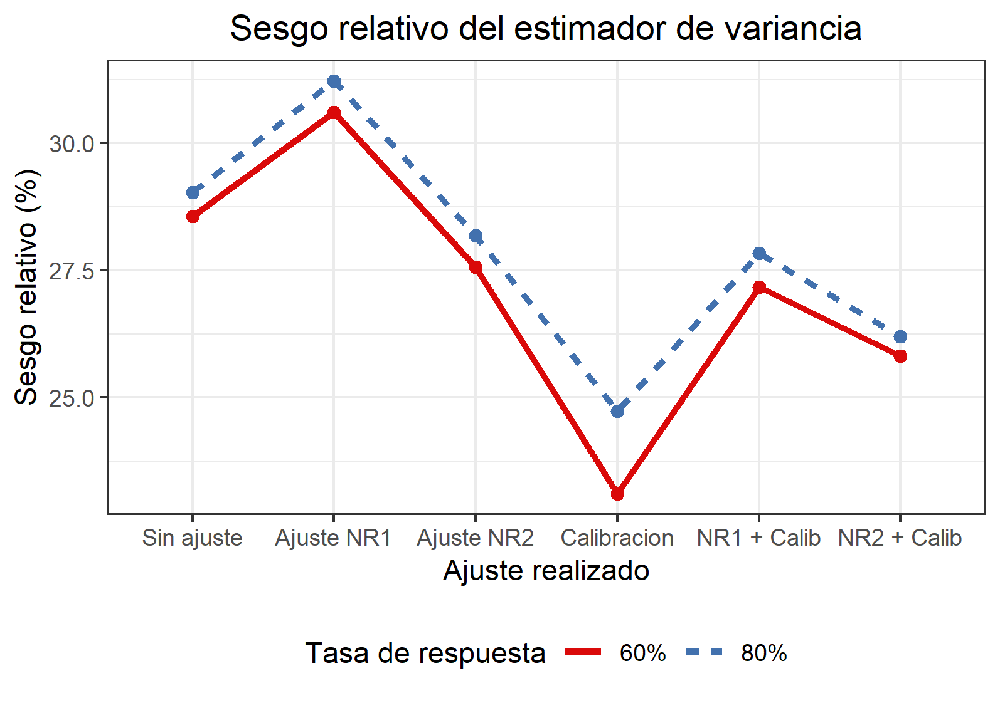
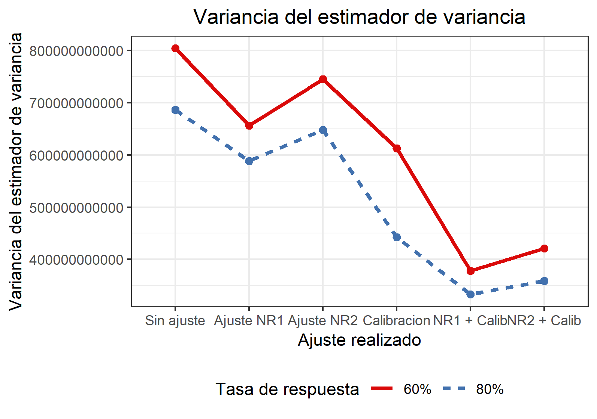
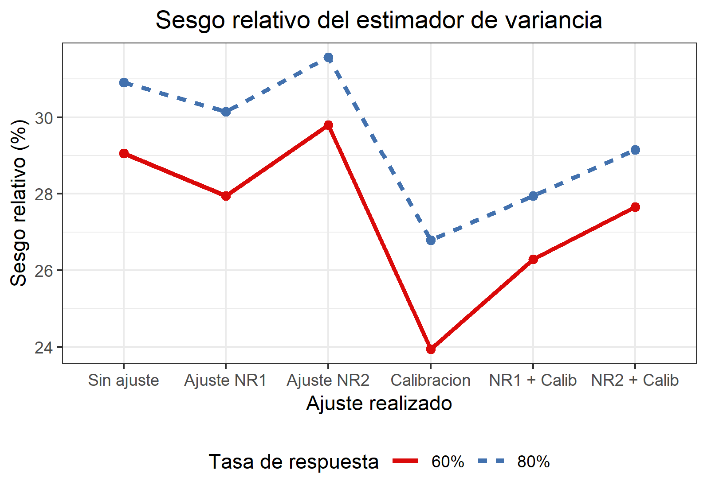
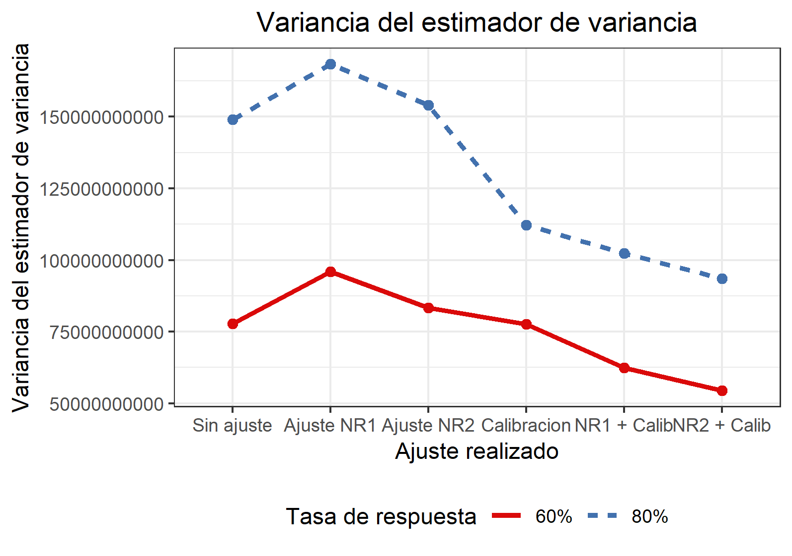

```{r setup, include=FALSE}
knitr::opts_chunk$set(echo = F, message = FALSE, warning = F, fig.align = "center")
```

# Diseños muestrales complejos

En los Institutos de Estadística los parámetros de interés se corresponden poblaciones distribuidas en un territorio geográfico muy extenso.

Generalmente, requiere la utilización de un diseño muestral complejo.

**Qué entendemos por un diseño muestral complejo:**

- Distintas probabilidades de selección.
- Múltiples etapas de muestreo.
- Estratificación de unidades en al menos una de las etapas.
- Selección de conglomerados en etapas inciales.

# El problema de la no respuesta

Decimos que existe un problema de no respuesta cuando se obtienen cuestionarios no completos en su totalidad.

- Disminuye el tamaño de muestra efectivo.
  + Incrementa el error de muestreo.
  + Limita la capacidad de generalizar conclusiones.
- Puede introducir sesgo en las estimaciones.

$$
B\left(\bar{y}_{HJ}\right) \approx CV_{\phi}\sigma_y\rho_{\phi,y}
$$

Donde: 

$y$ es la variable en estudio.  
$\phi$ es la probabilidad de respuesta.

# Ajustes por no respuesta

Aceptamos que la respuesta nunca será completa.

Se modifica el procedimiento de estimación original con el fin de **reducir el sesgo por no respuesta**.

- **Imputación**  
Procedimiento mediante el cual los valores faltantes son reemplazados por valores *artificiales*.

- **Ajuste de pesos**  
Incrementa los pesos muestrales de los encuestados de forma tal que se compense por la falta de respuesta cuando se realizan las estimaciones. 

# Ajustes por no respuesta

Dos enfoques (1/2)
\newline

**Enfoque de propensity score**

Busca lidiar con la no respuesta mediante la estimación directa de $\phi_k$ utilizando algún modelo y luego se realizan las estimaciones con los pesos ajsutados $d_k^* = d_k/\phi_k^{-1}$.

Se suelen crear clases donde se agrupan a los respondientes y se aplica un factor de ajuste común. Independientemente del método elegido, una de las formas posibles de calcular el factor de ajuste para la clase $c$ es 
$$
\hat{\phi}_k^{-1} = a_c = \frac{\sum_{k\in s_c}{d_k}}{\sum_{k\in s_{r,c}}{d_k}}
$$

# Ajustes por no respuesta

Dos enfoques (2/2)
\newline

**Enfoque de calibración**

Dado un vector $\mathbf{x_p}$ de variables auxiliares y su vector de totales conocidos $\mathbf{t_x}$, un conjunto de pesos calibrados es de la forma
$$
d_k^*=d_kF\left(\mathbf{x_k'}\lambda\right)
$$
donde el conjunto de pesos $\{d_k^*\}_{k \in s}$ satisface la ecuación de calibración, $\mathbf{\hat{t}_x} = \sum_{k \in s} {w_k\mathbf{t_x}} = \mathbf{t_x}$, y $F$ es un factor de ajuste que surge de minimizar una distancia entre los pesos de diseño y los pesos calibrados, sujeto a la ecuación de calibración.

Atractivo en el contexto de estadísticas oficiales por su característica de **consistentes**.

# Ajustes por no respuesta 

Una estategia generalmente utilizada es el ajuste a dos pasos.

1. Se multiplica al peso original $d_k$ por un factor de ajuste por no respuesta $\hat{\phi}_k^{-1}$. El objetivo es reducir el sesgo por no respuesta.
2. Calibración del peso ajustado. Se busca consistencia entre las estimaciones obtenidas y los totales poblacionales conocidos.  

Luego, 

$$
d_k^{*} = d_k\hat{\phi}_k^{-1}F\left(\mathbf{x_k'}\lambda\right)
$$

En el caso que $\mathbf{x_k}$ esté relacionado a $y_k$, el paso de calibración se asocia con una mejor eficiencia.

# Estimación de variancia

El ajuste de pesos muestrales tiene el propósito de disminuir el sesgo por no respuesta, pero produce estimadores no lineales.

El método de **linealización** es una alternativa. Pero requiere una derivación particular para cada estimador.

**Bootstrap** 

- Método general.
- Permite estimar la distribución en el muestreo del estimador.
- Refleja implicitamente en la variancia los efectos de los ajustes.
- No hay única alternativa en poblaciones finitas.


# Bootstrap según Rao, Wu y Yue (1992)

**In a nutshell**  

- Realiza un escalado de los pesos del diseño.
- Estima la variancia mediante la variabilidad de las unidades de primera etapa.
  + Aunque tengamos mas etapas!!
$$
V(\hat{\theta}) = V_{UPM} + V_{USM} + ...
$$

- Su derivación asume muestreo **con reemplazo**.

Se está eliminando el factor de correccion por finitud!  
Cuando el muestreo con reemplazo esto solo se puede hacer si la fracción es muy pequeña.


# Bootstrap según Rao, Wu y Yue (1992)

Wolter (2007) demuestra que para el caso que $\hat{\theta} = \hat{t}_y$, y con selección proporcional al tamaño:
$$
B\left(\hat{V}_{BS}(\hat{\theta})\right) = \sum_{h=1}^H{\frac{n_h}{n_h-1}\left(V_{pps}\left\{\frac{1}{n_h}\sum_k^{n_h}\frac{Y_{hk.}}{p_{hk}}\right\} - V_{\pi ps}\left\{\frac{1}{n_h}\sum_k^{n_h}\frac{Y_{hk.}}{\pi_{hk}}\right\}\right)}
$$

Luego, $\hat{V}_{BS}(\hat{\theta})$ tiene sesgo positivo siempre que la variancia del estimador sea menor bajo muestreo $\pi ps$ que bajo muestreo $pps$.

Además, 
$$
\hat{V}(\hat{\theta}) = \sum_{h=1}^H(1-f_h)\frac{n_h}{n_h-1}\sum_{i=1}^{n_h}(y_{hi}-\bar{y}_h)^2 + \sum_{h}^H{f_h*(\textrm{cont. de otras etapas})}
$$


# Aplicación

**Características**

Estudio por muestreo en **tres etapas** que tiene por objetivo estimar el ingreso medio de los hogares de un Estado.

- $\pi$ps, srswor, srswor.

Simulación de no respuesta bajo diversos escenarios. 

- **Completely missing at random:** Misma probabilidad.
- **Missing at random:** Depende de la cantidad gente en el hogar
- **Not missing at random:** Depende del ingreso!

Diversas estrategias de ajuste.

- Ajuste mediante propensity score.
- Calibración.
- Ajuste mediante propensity score + Calibración.

# Aplicación

**Parámetro de interés**   
$\mu$ = Ingreso medio de los hogar.

**Estimador puntual**
$$
\hat{\bar{y}}_{HJr} = \frac{\sum_{k \in s_r}{d_k^*y_k}}{\sum_{k \in s_r}{d_k^*}}
$$

donde $d_k^*$ es el peso ajustado para el k-ésimo hogar de la muestra (que responde) e $y_k$ es el ingreso observado para ese hogar.


**Estimador de variancia**  
En todos los casos se utilizó Bootstrap según Rao, Wu y Yue (1992)

# Aplicación

**Evaluación del estimador de variancia**

- Sesgo relativo del estimador de variancia
$$RB_{SIM}[\hat{V}(\hat{\bar{y}})] = \frac{E_{SIM}[\hat{V}(\hat{\bar{y}})]-V_{SIM}(\hat{\bar{y}})}{V_{SIM}(\hat{\bar{y}})}$$
donde  
$E_{SIM}[\hat{V}(\hat{\bar{y}})] = \frac{1}{1000}\sum_{j=1}^{1000}{\hat{V}(\hat{\bar{y}})}_{(j)}$ esperanza simulada de la variancia y     
$V_{SIM}(\hat{\bar{y}})= \frac{1}{10000}\sum_{j=1}^{10000}{\left[\hat{\bar{y}}_{(j)} - E_{SIM}[\hat{\bar{y}}]  \right]^2}$ variancia simulada del estimador.


- Variancia del estimador de variancia
$$V_{SIM}[\hat{V}(\hat{\bar{y}})] = \frac{1}{1000}\sum_{j=1}^{1000}\left[\hat{V}(\hat{\bar{y}})_{(j)} - E_{SIM}[\hat{V}(\hat{\bar{y}})]\right]^2$$ 

# Resultados 

\center
**Missing completely at random**
\center

\begin{columns}
\column{.5\textwidth}
```{r, out.width = "170px", out.height = "150px"}

```
\column{.5\textwidth}
```{r, out.width = "170px", out.height = "150px"}

```
\end{columns}

# Resultados

\center
**Missing at random**
\center

\begin{columns}
\column{.5\textwidth}
```{r, out.width = "170px", out.height = "150px"}

```
\column{.5\textwidth}
```{r, out.width = "170px", out.height = "150px"}

```
\end{columns}


# Resultados
\center
**Not missing at random**
\center

\begin{columns}
\column{.5\textwidth}
```{r, out.width = "170px", out.height = "150px"}

```
\column{.5\textwidth}
```{r, out.width = "170px", out.height = "150px"}

```
\end{columns}

# Conclusiones 

Las estimaciones de variancia son muy conservadoras.

- Nos previene de IC exageradamente estrechos... pero es mucho sesgo.

Pueden ser varios los motivos que causen el sesgo.

- El muestreo utilizado sin reemplazo es mas eficiente que si fuera realizado con reemplazo.
- Fracciones de muestreo en estratos de UPM no depreciables.

Otros estudios muestran resultados similares cuando la fracción de muestreo y el sesgo.

Existen alternativas que buscan utilizar las fracciones de muestreo en el proceso de estimación.

- No muy estudiadas aún.

# Conclusiones 

**Para trabajos futuros**...

- Otros diseños.
- Menores fracciones de muestreo.
- Ajustes de corrección por finitud.
- Estimadores no suaves.