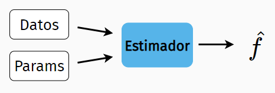
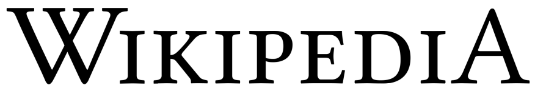

```{r setup, include=FALSE}
options(htmltools.dir.version = FALSE, tibble.max_extra_cols = 6, tibble.width = 60)
knitr::opts_chunk$set(warning = FALSE, message = FALSE,
                      fig.align = "center", dpi = 320, fig.height = 4.5)
library(tidyverse)
library(gganimate)
library(transformr)
library(tweenr)

# Define colors
LIGHT_BLUE <- "#56B4E9"
LIGHT_GRAY <- "#474747"
DARK_RED <- "#c0392b"
```

class: center, inverse, takeaways

## **Qué es un estimador de densidad**

---

class: center, inverse, takeaways

## ~~Qué es un estimador de densidad~~

## **Por qué me interesa estudiarlos**

---

class: center, inverse, takeaways

## ~~Qué es un estimador de densidad~~

## ~~Por qué me interesa estudiarlos~~

## **El status-quo**

---

class: center, inverse, takeaways

## ~~Qué es un estimador de densidad~~

## ~~Por qué me interesa estudiarlos~~

## ~~El status-quo~~

## **Hacia un mundo mejor**

---

class: center, inverse, takeaways

##  *Qué es un estimador de densidad*

## ~~Por qué me interesa estudiarlos~~

## ~~El status-quo~~

## ~~Hacia un mundo mejor~~

---

# Qué es

Se tiene una muestra de datos $X_1, X_2, \cdots, X_n$ que provienen de una distribucion de probabilidad $f$ continua y desconocida.

--

*Objetivo:* A partir de los datos, queremos obtener una estimación de $f$.

--

Luego, llamaremos **.underline[estimador de densidad]** a un algorítmo o fórmula matemática que a partir de un conjunto de datos, nos devuelve una función de densidad.

--

<br>

```{r, echo=FALSE, out.width="500px", dpi=300}

```

<br>
<hr>

.small[
[1] Cada método suele depender de uno o más parámetros.
]

---

# Ejemplo

```{r, echo = FALSE, out.width="700px", out.height="400px"}
par(bg = NA, mar = c(2, 1, 1, 1))
hist(airquality$Solar.R, breaks = 20, col = LIGHT_BLUE,
     ann = FALSE, yaxt = "n", freq = FALSE)
abline(h = 0, lwd = 2)
rug(airquality$Solar.R, lwd = 1.5)
```

$X:$ Radiación solar diaria entre 1-05-1973 y 30-09-1973 en NY. 

<!-- Para el histograma: Lo de punto inicial y parametro ventana. El histograma es un estimador discontinuo, que ademas depende de la eleccion de un punto inicial y de un parametro ventana. -->
---

# Ejemplo

```{r, echo = FALSE, out.width="700px", out.height="400px"}
dens <- density(airquality$Solar.R, na.rm = TRUE)
par(bg = NA, mar = c(2, 1, 1, 1))
plot(dens$x, dens$y, type = "l", col = LIGHT_BLUE,
     lwd = 4, ann = FALSE, yaxt = "n", bty = "n")
abline(h = 0, lwd = 2)
rug(airquality$Solar.R, lwd = 1.5)
```

$X:$ Radiación solar diaria entre 1-05-1973 y 30-09-1973 en NY. 

---

class: center, inverse, takeaways

##  ~~Qué es un estimador de densidad~~

##  *Por qué me interesa estudiarlos*

## ~~El status-quo~~

## ~~Hacia un mundo mejor~~

---

# Por qué lo estudio

--

En la *Estadística Bayesiana* la incertidumbre sobre los parámetros de interés se cuantifica a través de distribuciones de probabilidad.

--

<hr>

.pull-left30[
<br>
```{r, echo=FALSE, out.width="250px", dpi=300}
knitr::include_graphics("imgs/arviz_logo.png")
```
]

.pull-right70[
*ArviZ* es una librería de Python para el análisis exploratorio de modelos Bayesianos.  
Como tal, utiliza estimadores de densidad para reflejar las **distribuciones a posteriori** de los parámetros del modelo.
]

<hr>

--

#### Dos aplicaciones .underline[fundamentales]

--

1. Obtener información de la estructura de los datos / parámetros.

1. Simulación de muestras.

--

.center[.bold[Un mal estimador de densidad puede conducir   
a .red[interpretaciones erróneas] e .red[inferencias inconsistentes.]]]

---

class: center, inverse, takeaways

##  ~~Qué es un estimador de densidad~~

## ~~Por qué me interesa estudiarlos~~

##  *El status-quo*

## ~~Hacia un mundo mejor~~


---
class: split-two

# Dos caminos

--

.row[
<br>
<br>

.pull-left[
.middle[
```{r, echo=FALSE, out.width="200px"}
knitr::include_graphics("imgs/drake_1.PNG")
```
]]

.pull-right[
.middle[.center[
## Métodos paramétricos
]]]

]

.row[

.pull-left[
<br>
<br>
]

.pull-right[
<br>
<br>
]

]


---
class: split-two

background-image: url(imgs/rainbow.png)
background-position: 81% 82%
background-size: 130px


# Dos caminos

.row[
<br>
<br>

.pull-left[
.middle[
```{r, echo=FALSE, out.width="200px"}
knitr::include_graphics("imgs/drake_1.PNG")
```
]]

.pull-right[
.middle[.center[
## Métodos paramétricos
]]]

]

.row[

.pull-left[
.middle[
```{r, echo=FALSE, out.width="200px"}

```
]]

.pull-right[
.middle[.center[
## **Métodos no paramétricos**
]]]

]

<!-- Objetivo: Estimar f de manera no paramétrica (sin hacer hipótesis sobre la forma de la distribucion). -->


<!-- La suposicion inicial de que la poblacion de la que proceden los datos sigue un modelo parametrico puede limitar mucho el ajuste del modelo. -->

<!-- Por ello es deseable considerar tecnicas no parametricas que olviden cualquier hipotesis previa y trabajen unicamente con la informacion que proporcionan los datos; teniendo siempre presente la aleatoriedad intrınseca a los mismos. -->
---

# El súper-clásico

```{r, echo=FALSE, out.width="600px", dpi = 300}

```

--

<hr>

```{r, echo=FALSE, out.width="200px", dpi = 300}

```

--

El .bold[estimador de densidad mediante kernel (KDE)] es

$$\hat{f}_h (x) = \frac{1}{n}\sum_{i=1}^{n}{K_h(x - x_i)} = \frac{1}{nh}\sum_{i=1}^{n}{K\left(\frac{x - x_i}{h}\right)}$$

donde $K$ es el **kernel** &mdash; función no negativa &mdash; y $h > 0$ es el *parámetro de suavizado* llamado **bandwidth**.

---

# El súper-clásico

.large[.bold[Estimador mediante kernel Gaussiano]]

--

$$\begin{split}
  \hat{f}_h(x) & = \frac{1}{nh}\sum_{i=1}^{n}{\varphi\left(\frac{x - x_i}{h}\right)}  \\
  & = \frac{1}{n} \sum_{i=1}^{n}{\frac{1}{\sqrt{2\pi} h} \exp{ \left[ -\frac{1}{2} \left( \frac{x - x_i}{h} \right) ^ 2           \right]}}
\end{split}$$

--

<hr>

.center[.large[**.underline[.cursive[.bold[In a nutshell:]]]**]]

.center[El KDE Gaussiano es un .bold[.underline[promedio simple de]] $n$ .bold[.underline[distribuciones normales]]  
con media $x_i$ y desvío estándar $h$.]

---

# Gaussian KDE 

```{r, echo = FALSE, out.width="700px", dpi = 300}
set.seed(32111)

rvs <- c(rnorm(5), rnorm(3, 0.9, 0.6))
x_grid <- seq(-3, 4.2, length.out = 500)
h <- 0.45

par(bg = NA, mar = c(2, 2.4, 1, 1))

plot(1, type = "n", xlim = c(-3, 3.3), ylim = c(0, 1),
     ann = FALSE, xaxt = "n", bty = "n",
     las = 2)
abline(h = 0, lwd = 2)
points(rvs, y = rep(0, length(rvs)), cex = 2, lwd = 2, pch = 21, bg = DARK_RED)

```

Supongamos que tengo una muestra de datos, en este caso $n=8$.

---

# Gaussian KDE 

```{r, echo = FALSE, out.width="700px", dpi = 300}

par(bg = NA, mar = c(2, 2.4, 1, 1))
plot(1, type = "n", xlim = c(-3, 3.3), ylim = c(0, 1),
     ann = FALSE, xaxt = "n", bty = "n",
     las = 2)

abline(h = 0, lwd = 2)

out <- sapply(rvs, FUN = function(x) dnorm(x_grid, x, h))

for (j in seq_along(rvs)) {
  lines(x_grid, out[, j], lty = "dashed", lwd = 2, col = LIGHT_GRAY)
}

points(rvs, y = rep(0, length(rvs)), cex = 2, lwd = 2, pch = 21, bg = DARK_RED)
```

Pongo una Gaussiana centrada en cada valor observado $x_i$, con desvío $h$.

---

# Gaussian KDE 

```{r, echo = FALSE, out.width="700px", dpi = 300}

par(bg = NA, mar = c(2, 2.4, 1, 1))
plot(1, type = "n", xlim = c(-3, 3.3), ylim = c(0, 0.45),
     ann = FALSE, xaxt = "n", bty = "n",
     las = 2)

abline(h = 0, lwd = 2)

for (j in seq_along(rvs)) {
  lines(x_grid, out[, j] / 8, lty = "dashed", lwd = 2, col = LIGHT_GRAY)
}

points(rvs, y = rep(0, length(rvs)), cex = 2, lwd = 2, pch = 21, bg = DARK_RED)

```

Escalo cada Gaussiana según su correspondiente peso.  
Por ser un promedio simple uso $1/n$.

---

# Gaussian KDE 

```{r, echo = FALSE, out.width="700px", dpi = 300}

par(bg = NA, mar = c(2, 2.4, 1, 1))
plot(1, type = "n", xlim = c(-3, 3.3), ylim = c(0, 0.45),
     ann = FALSE, xaxt = "n", bty = "n",
     las = 2)

abline(h = 0, lwd = 2)

y <- apply(out, 1, mean)

for (j in seq_along(rvs)) {
  lines(x_grid, out[, j] / 8, lty = "dashed", lwd = 2, col = LIGHT_GRAY)
}

points(rvs, y = rep(0, length(rvs)), cex = 2, lwd = 2, pch = 21, bg = DARK_RED)

lines(x_grid, y, col = LIGHT_BLUE, lwd = 4)
```

Sumo las densidades y obtengo mi estimación $\hat{f}$.

--

En su versión clásica, $h$ se elige por un método llamado .bold[Gaussian rule of thumb].

---

# Gaussian KDE

```{r, echo = FALSE, cache = TRUE, dpi = 300, out.width="700px"}
set.seed(1234)
obs <- rnorm(500)
bw <- c(seq(0.05, 0.5, by = 0.025), seq(0.5, 10, by = 0.25))
df <- as.data.frame(matrix(nrow = 0, ncol = 3))

for (b in bw) {
  
  dens <- density(obs, bw = b)
  df <- rbind(df, cbind(dens$x, dens$y, b))
  
}

colnames(df) <- c("x_grid", "y_kde", "bandwidth")

df$y_true <- dnorm(df$x_grid)

ggplot(df) +
  geom_line(aes(x_grid, y_kde), 
            color = DARK_RED, 
            size = 2) + 
  geom_line(aes(x_grid, y_true),
            color = LIGHT_GRAY,
            size = 2) + 
  labs(
    title = "",
    x = "Bandwidth: {closest_state}",
    y = ""
  ) + 
  scale_x_continuous(
    limits = c(-3.5, 3.5)
  ) +
  theme_minimal(
  )  +
  theme(
    axis.title.x = element_text(size = 20)
  ) +
  transition_states(bandwidth) +
  ease_aes("exponential-in")
  # tweenr::display_ease("linear")
```

---

# Gaussian KDE 

<!-- .green no esta definido aun! -->

.center[.xlarge[.green[.bold[The good]]]]

- Muy simple y muy estudiado.
- Implementación rápida a través de convolución y FFT.
- Buen desempeño para distribuciones unimodales y levemente asimétricas.

--

.center[.xlarge[.red[.bold[The bad]]]]

- Asume que $X \in \mathbb{R}$.
- Por defecto, la estimación extrapola el dominio de los datos.
  <!-- + Puede ser muy .bold[engañoso] al observar una posterior. -->
- No está claro como adaptarlo a dominios acotados.

--

.center[.xlarge[.black[`r emo::ji("poop")` .bold[The ugly] `r emo::ji("poop")`]]]

- Las implementaciones mas populares usan la regla gaussiana para $h$.
- Desempeño .bold[pésimo] para distribuciones .bold[multimodales] y .bold[muy asimétricas].
  + Sobre-suaviza las distribuciones.
  + .bold[No mejora con más datos].

---

# Gaussian KDE - Ejemplo 1

```{r, echo = FALSE, dpi = 300, , out.width="700px"}
set.seed(1234)
size <- 500

pdf_func <- function(x) {
  0.75 * dnorm(x) + 0.25 * dnorm(x, mean = 1.5, sd = 1 / 9)
}

rvs <- c(rnorm(round(size * (2/3))),
         rnorm(round(size * (1/3)), mean = 1.5, sd = 1 / 9))

dens <- density(rvs)
x_val <- dens$x
y_est <- dens$y

par(bg = NA, mar = c(2, 2.4, 1, 1))
plot(x_val, pdf_func(x_val), type = "l", 
     col = LIGHT_BLUE, lwd = 4,
     bty = "n", las = 1,
     ann = FALSE,
     xlim = c(-3, 3.5))
lines(x_val, y_est, lwd = 4,
      col = LIGHT_GRAY)
abline(h = 0, lwd = 2)
legend(-3, 0.8, 
       c("True", "Gaussian KDE"), 
       col = c(LIGHT_BLUE, LIGHT_GRAY),
       lty = 1, lwd = 4, cex = 1.2,
       bty = "n")
```

---

# Gaussian KDE - Ejemplo 2

```{r, echo = FALSE, dpi = 300, , out.width="700px"}
set.seed(1234)
size <- 500

pdf_func <- function(x) {
  0.5 * dnorm(x, mean = 0, sd = 0.1) + 0.5 * dnorm(x, mean = 5, sd = 1)
}

rvs <- c(rnorm(size / 2, mean = 0, sd = 0.01),
         rnorm(size / 2, mean = 5, sd = 1))

dens <- density(rvs)
x_val <- dens$x
y_est <- dens$y

par(bg = NA, mar = c(2, 2.4, 1, 1))
plot(x_val, pdf_func(x_val), type = "l", 
     col = LIGHT_BLUE, lwd = 4,
     bty = "n", las = 1,
     ann = FALSE,
     xlim = c(-2, 10))
lines(x_val, y_est, lwd = 4,
      col = LIGHT_GRAY)
abline(h = 0, lwd = 2)
legend(5, 1.6, 
       c("True", "Gaussian KDE"), 
       col = c(LIGHT_BLUE, LIGHT_GRAY),
       lty = 1, lwd = 4, cex = 1.2,
       bty = "n")
```

---

# Gaussian KDE - Ejemplo 3

```{r, echo = FALSE, dpi = 300, , out.width="700px"}
set.seed(1234)
size <- 500

pdf_func <- function(x) {
  dgamma(x, shape = 1.2, scale = 1)
}

rvs <- rgamma(size, shape = 1.2, scale = 1)

dens <- density(rvs)
x_val <- dens$x
y_est <- dens$y

par(bg = NA, mar = c(2, 2.4, 1, 1))
plot(x_val, pdf_func(x_val), type = "l", 
     col = LIGHT_BLUE, lwd = 4,
     bty = "n", las = 1,
     ann = FALSE,
     xlim = c(-1, 8))
lines(x_val, y_est, lwd = 4,
      col = LIGHT_GRAY)
abline(h = 0, lwd = 2)
legend(4.5, 0.5, 
       c("True", "Gaussian KDE"), 
       col = c(LIGHT_BLUE, LIGHT_GRAY),
       lty = 1, lwd = 4, cex = 1.2,
       bty = "n")
```

---

class: center, inverse, takeaways

## ~~Qué es un estimador de densidad~~

## ~~Por qué me interesa estudiarlos~~

## ~~El status-quo~~

## *Hacia un mundo mejor*

---

# Hacia un mundo mejor

Existen métodos para seleccionar un mejor ancho de banda. De hecho *ArviZ* ya usa una adaptación del KDE Gaussiano clásico.

--

- Plug-in, validación cruzada, correcciones, etc.

--

- Existen pocas implementaciones y no son muy populares.

--

- Tampoco son la panacea.

--

<hr>

Las mejores alternativas que encontramos son los **.bold[métodos adaptativos]**.

- En vez de utilizar un $h$ constante, lo adaptan según la región de estimación.

--

- No hay una única alternativa, ni jugador de toda la cancha.

--

- En general, no son tan sencillos como el KDE.

--

- En algunos casos el costo computacional es un problema muy serio.

---

# Hacia un mundo mejor

.large[.bold[Ejemplo]]

```{r, echo = FALSE, out.width = "925px"}
vals <- c(2.8, 3.2, 3.4, 3.5, 3.8, 6.2)

h_opt <- rep(0.6, 6)
h_ada <- c(0.59, 0.51, 0.51, 0.51, 0.56, 1.06)


x_grid <- seq(0, 9, length.out = 100)

out <- mapply(FUN = function(x, mean, sd) {dnorm(x, mean, sd)}, 
              mean = vals, sd = h_ada, 
              MoreArgs = list(x = x_grid))

out <- out / 6

y_est <- apply(out, 1, sum)

par(bg = NA, mar = c(1.2, 2.4, 0.2, 0.1), mfrow = c(1, 2))

plot(x_grid, y_est, type = "l", 
     bty = "n", xaxt = "n",
     lwd = 4, col = LIGHT_BLUE,
     xlim = c(0, 9), 
     ylim = c(0, 0.55),
     las = 1)

aux <- apply(out, 2, 
      FUN = function(y) {
        lines(x_grid, y, lwd = 2, lty = "dashed", col = LIGHT_GRAY)
        })
points(vals, y = rep(0, length(vals)), cex = 2, lwd = 2, pch = 21, bg = DARK_RED)


out <- mapply(FUN = function(x, mean, sd) {dnorm(x, mean, sd)}, 
              mean = vals, sd = h_opt, 
              MoreArgs = list(x = x_grid))
out <- out / 6

y_est <- apply(out, 1, sum)

plot(x_grid, y_est, type = "l", 
     bty = "n", xaxt = "n",
     lwd = 4, col = LIGHT_BLUE,
     xlim = c(0, 9), 
     ylim = c(0, 0.55),
     las = 1)
aux <- apply(out, 2, 
      FUN = function(y) {
        lines(x_grid, y, lwd = 2, lty = "dashed", col = LIGHT_GRAY)
        })
points(vals, y = rep(0, length(vals)), cex = 2, lwd = 2, pch = 21, bg = DARK_RED)

```

---

# Hacia un mundo mejor


.large[.bold[Cómo sigue?]]

--

.center[.xlarge[.cursive[**.underline[Póster!]**]]]

--

1. Hicimos una revisión bibliográfica bastante exhaustiva.

1. Implementamos los métodos que no estaban implementados.

1. Simulamos datos de toda raza, religión y color.

1. Estimamos las densidades con cada estimador y computamos el error.


--


---

class: inverse, center, middle


Slides creadas con el paquete de R [xaringan](https://github.com/yihui/xaringan).